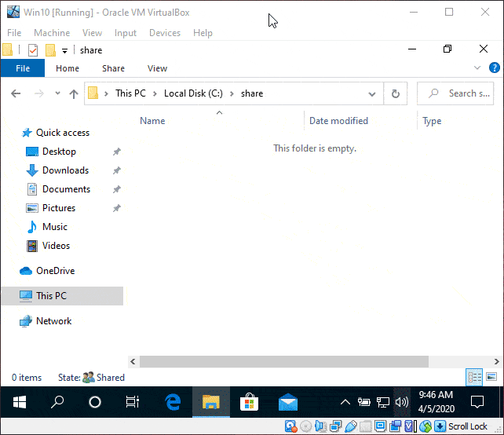

# CVE-2020-1206 Uninitialized Kernel Memory Read POC

(c) 2020 ZecOps, Inc. - https://www.zecops.com - Find Attackers' Mistakes  
POC to check for CVE-2020-1206 / "SMBleed"  
Expected outcome: Local file containing target computer kernel memory.  
Intended only for educational and testing in corporate environments.  
ZecOps takes no responsibility for the code, use at your own risk.  
Please contact sales@ZecOps.com if you are interested in agent-less DFIR tools for Servers, Endpoints, and Mobile Devices to detect SMBleed and other types of attacks automatically.

## Usage

`SMBleed.exe server_name ip_address domain user pass share_name remote_path local_path`

## Compiled POC

You can get the compiled POC [here](https://github.com/ZecOps/CVE-2020-1206-POC/releases).

## Compiling

Use Visual Studio to compile the following projects:

1. `ProtoSDK\Asn1Base\Asn1Base.csproj`
2. `ProtoSDK\MS-XCA\Xca.csproj`
3. `ProtoSDK\MS-SMB2\Smb2.sln`

Use the resulting exe file to run the POC.

## References

* [SMBleedingGhost Writeup: Chaining SMBleed (CVE-2020-1206) with SMBGhost - ZecOps Blog](https://blog.zecops.com/vulnerabilities/smbleedingghost-writeup-chaining-smbleed-cve-2020-1206-with-smbghost/)
* [CVE-2020-1206 - Microsoft Security Response Center](https://portal.msrc.microsoft.com/en-us/security-guidance/advisory/CVE-2020-1206)
